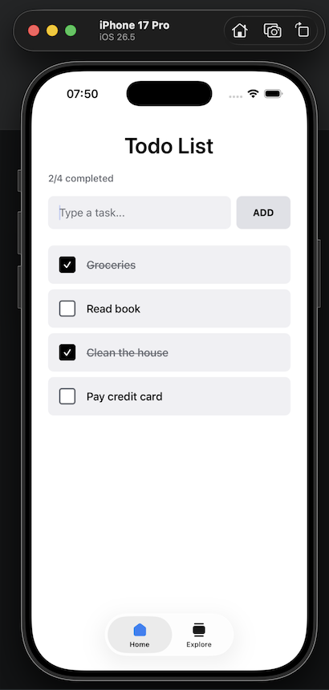

# Todo app 👋

## The App :)

This is my first Mobile PoC.

Stack:
- Expo
- React Native
- Appium




## Setup

1. Install dependencies

```bash
npm install
```

2. Start the app

```bash
npx expo start
```

3. Start Appium Server

```bash
appium
```


4. Run the e2e test

```bash
npx wdio run e2e/wdio.conf.ts
```

You should see the report like this:

```bash
 "spec" Reporter:
------------------------------------------------------------------
[iOS #0-0] Running: on iOS
[iOS #0-0] Session ID: 7f0779fb-8033-439d-aef7-060db489609d
[iOS #0-0]
[iOS #0-0] » e2e/specs/todo.spec.ts
[iOS #0-0] TODO app
[iOS #0-0]    ✓ creates a task and updates the counter
[iOS #0-0]    ✓ marks a task as completed and back
[iOS #0-0]    ✓ deletes a task via long-press confirmation
[iOS #0-0]
[iOS #0-0] 3 passing (15.2s)

```


## Build .ipa


Get the team ID:

```bash
xcodebuild -showBuildSettings \
  -workspace ios/todopoc.xcworkspace \
  -scheme todopoc | grep DEVELOPMENT_TEAM
```

Replace 'TEAM_ID' and create ExportOptions file.

```bash
cat > ios/ExportOptions.plist <<'EOF'
<?xml version="1.0" encoding="UTF-8"?>
<!DOCTYPE plist PUBLIC "-//Apple//DTD PLIST 1.0//EN"
  "http://www.apple.com/DTDs/PropertyList-1.0.dtd"\>
<plist version="1.0">
<dict>
    <key>method</key>
    <string>development</string>
    <key>signingStyle</key>
    <string>automatic</string>
    <key>teamID</key>
    <string>{TEAM_ID}</string>
</dict>
</plist>
EOF
```

After run the following script to build and export ios *.ipa

```bash
./scripts/build-ios.sh
```
